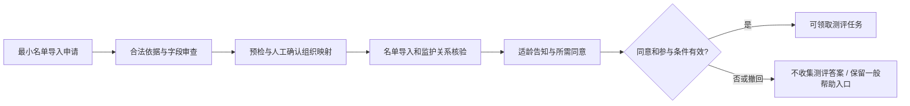
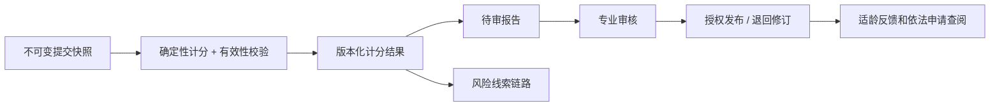
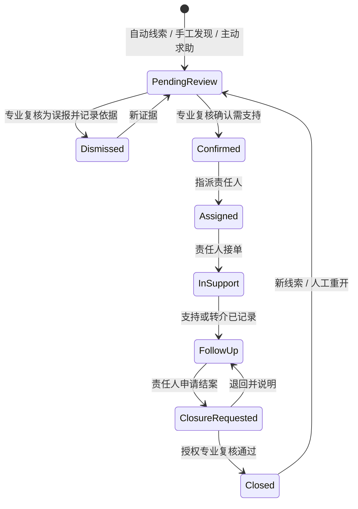

# 角色、权限与业务流程

## 1. 权限模型

采用 **角色权限 RBAC + 租户/学校/班级/个案分配/用途/时限等属性约束**。角色名不意味着全量心理资料访问权；每个请求在服务端执行对象级与字段级检查。

| 角色 | 名单/组织 | 测评内容与结果 | 心理档案/个案 | 管理统计 | 关键限制 |
|---|---|---|---|---|---|
| 平台运维 | 仅租户配置与必要技术元数据 | 默认无权 | 默认无权 | 服务指标，不含心理指标 | 临时支持权限必须有审批、范围、原因、到期和审计 |
| 校方管理员 | 本校授权范围 | 分发任务、看完成状态；不看个体答案/风险等级 | 默认无权 | 抑制小样本后的校级聚合 | 不共享账号，不得给自己临时加心理专业权限 |
| 心理专业负责人 | 工作必要范围 | 审定量表/规则、审核解释 | 经授权的本校个案、分配与结案审批 | 工作必要聚合 | 关键配置实行作者/审批者分离 |
| 心理教师/咨询师 | 被授权的服务对象 | 指定个案的结果与解释 | 指派个案、接触和支持记录 | 自己工作范围 | 查看原始答案需进一步明确权限和用途 |
| 班主任 | 本班名单、任务完成状态 | 不见分数、原始答案或风险等级 | 仅最小化的关怀协作事项 | 不展示班内心理风险分布 | 不得通过导出或筛选绕过权限 |
| 学生 | 自己必要资料 | 自己任务、已审核发布的适龄反馈 | 可提权利请求，不默认展示专业工作笔记 | 无 | 不能自行修改/解除风险状态 |
| 监护人 | 经核验的本人监护关系 | 告知及依法提供的反馈 | 权利申请与安全评估流程 | 无 | 不因知晓学号就能绑定；不自动推送完整记录 |
| 审计/隐私负责人 | 最小元数据 | 默认不读取答卷 | 看访问与处理流程，按事件特批 | 合规指标 | 不能修改审计事件或以审计名义批量导出 |

学校工作人员可以兼任岗位，但系统中使用具名身份与显式授权。结案/规则审批默认由另一位有资格人员复核；小校若只有一人，需在试点前落实校外督导或其他合格审批者，不能用共享账号伪造双审。

## 2. 导入与知情参与

名单导入本身就是个人信息处理：在首次收集前确认其合法依据；不得先大量导入资料再补一张同意书。必要的邀请名册若有独立合法依据，应限定字段、用途、保存期，未同意不生成心理档案。监护关系使用校方已有验证渠道，不默认收身份证照片。年龄未知时进入待核验，不能默认为 ≥14 岁。

## 3. 任务、频次与答题状态

- 任务：`draft → approved → scheduled → open → closed → archived`；可 `paused`、`cancelled`，恢复须重查发布门槛。
- 发布时快照：成员、学年、时间窗、测评方案版本、告知版本、报告可见性、专业值班与风险规则版本。
- 发布、领取、开始时均校验适龄、授权有效期、同意、频次和任务状态；核心频次占用在同一数据库事务中完成，防双任务并发绕过。
- 项目保守默认：同一学生每学年一个经批准的测评场次。一次场次含哪些量表由专业负责人定义，不允许无限装入量表增加负担。该计数单位属于待校方确认的实施解释，不是政策对“1 次”的法律定义。
- 重复作答/专业复评如有必要，需另记用途、依据、专业与校方审批、重新告知及所需同意；不是管理员按钮直接跳过限制。转校时通过合法的最小频次声明核对，不跨校检索心理档案；情况不明人工核验。
- 答卷：`not_started → in_progress → submitted → scoring_pending → scored / scoring_failed / invalid`；另有 `withdrawn / expired`。未完成不计为正常或无风险。
- 每次保存返回服务端 `revision`、时间与持久化状态；客户端旧版本提交返回冲突，不覆盖已保存答案。提交使用幂等键，提交后的答卷不可更改。
- 不把敏感答案存入 localStorage / IndexedDB / Service Worker 缓存；断网只保留当前页面内存，清楚提示未保存。刷新恢复仅读取服务端已提交保存的草稿。
- 共享终端不得保留登录或报告；完成后主动退出并清理视图，浏览器后退不得露出前一学生数据。

## 4. 计分与报告发布

报告可 `draft → pending_review → approved → released → revoked`；修订产生新版本而非覆盖历史。发布权限和读取权限分别检查；下载当时再鉴权。反馈不是“你有某疾病”的断言，应解释测量局限和可获得的支持。紧急线索不能等待报告排版或审批。

## 5. 危机线索与支持状态机

- 严重即时线索走独立加急通知/人工响应路径，不必顺次等待普通队列状态。软件不单独判定真实危机程度，任何等级由专业规则和人工判断共同治理。
- 已提交且触发明确紧急关注项的事件用高优先级持久化 outbox 发送；人工主动求助同样不受量表计分任务阻塞。草稿是否需要触发由 M0 专业协议明确告知，MVP 不悄悄监测未提交草稿。
- 线索包含来源、规则版本、触发原因、时间和授权证据；重复事件归并但保留所有证据；新严重线索不能被旧低风险状态吞掉。
- 通知只包含“有待处理事项”和受保护入口，不在短信/邮件中泄漏学生姓名、分数或原因。
- 必须确认“人已接单”，不能把第三方消息“发送成功”当作已处置。超时按校方批准的时限升级备用人员；失联与供应商故障有线下人工接续。
- 分值下降、时间经过、学生自助申请都不能关闭个案。学生可申请帮助/提出异议；专业人员记录支持效果及结案依据。
- 涉及疑似家庭侵害时，不能自动通知可能构成风险的监护人；由受训人员按学校保护制度和适用法律决定保护、报告及安全联系对象。不得由算法自动发送风险详情。
- 预约、AI、复测均不能替代即时支持；页面明确服务时段，给出经校方核实的当地紧急援助渠道。正式上线前完成联系方式核验，不能发布占位号码。

## 6. 预约与内容（M5）

预约状态 `requested → confirmed → completed / cancelled / no_show`，改期为原预约取消加新预约，数据库约束避免同一咨询师/房间时间重叠。仅处理预约与服务记录，不据此提供在线诊疗。

内容 `draft → professional_review → published → retired`；管理员不能绕开专业审查，案例采用虚构或充分授权匿名材料。所有附件私有或经审核明确为公共教育资源，不混用报告存储桶。
