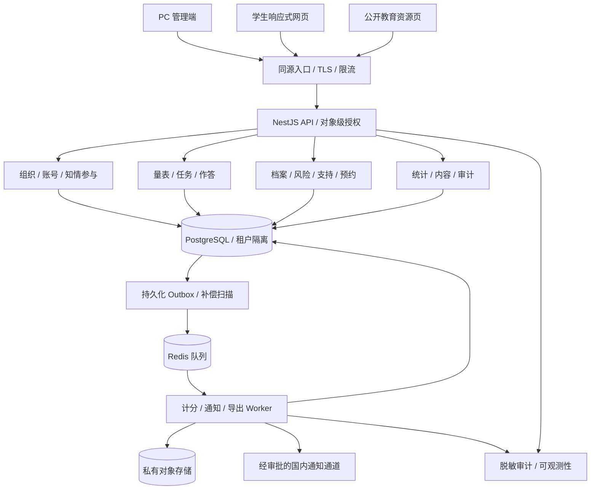

# 技术架构

状态：建议生产架构 + Node 20 合成数据参考实现。参考实现用于自动化验收，不等于生产依赖已经锁定或上线；正式版本仍需在 M1/M4 完成供应商、性能、专业和隐私证据。

## 1. 总体设计

**模块化单体 + 独立异步 Worker + 单一关系数据库**。业务复杂度集中在权限、计分可复现和流程可靠性，不提前增加微服务治理成本。



统计只读经审批的聚合视图，不能让 BI 或运维平台直连读取全部答卷。公开资源与敏感 API 分离缓存策略。

## 2. 选型与原因

| 层 | 建议 | 原因 / 限制 |
|---|---|---|
| 单仓 | TypeScript + pnpm workspace | 共享类型与计分测试；先不引入额外构建编排服务 |
| 管理端 | React + Vite + 成熟表单/组件库 | 复杂表格、审批和可访问交互；组件库在 M1 试用确认 |
| 学生端 | 独立 React + Vite 应用 | 轻量响应式、与管理端分包；不缓存敏感离线内容 |
| API | NestJS REST / OpenAPI | 模块边界、鉴权与 DTO 校验；不在浏览器计分作为权威 |
| 数据库 | PostgreSQL + 显式迁移 | 事务、唯一约束、行级安全；应用查询层在 M1 选定并证明 RLS 兼容 |
| 作业 | Redis + BullMQ（候选）及 PostgreSQL outbox | 队列不作为唯一持久化来源；任务必须幂等，失联可补投 |
| 文件 | 私有 S3 兼容对象存储 + KMS | 报告/导入文件短时访问；选型不等于购买特定云服务 |
| 测试 | 单元/集成、Playwright E2E、合成压测 | CI 只使用合成样本，不上传真实心理资料 |
| 部署 | 容器镜像 + 国内托管数据服务或校方私有环境 | 优先可维护性、备份和数据边界；不预先采购或部署 |

本方案不主张所有数据法律上一律不得跨境，而是采取**默认不跨境**的保守工程边界。若需跨境，先完成独立法律评估与授权，不用国外日志/AI 服务悄悄处理数据。

官方技术依据：[Vite 指南](https://vite.dev/guide/)、[NestJS 文档](https://docs.nestjs.com/)、[PostgreSQL 行级安全](https://www.postgresql.org/docs/current/ddl-rowsecurity.html)。队列及组件库仅为候选，M1 还需验证锁定版本，未声称已实现集成。

## 3. 建议目录与当前实现

```text
apps/
  admin-web/          # 校方与专业人员工作台
  student-web/        # 学生任务、支持、教育资源
  api/                # REST 与领域模块
  worker/             # 异步计分、通知、导出
packages/
  contracts/          # 请求/响应 schema 与错误码
  scoring/            # 无网络、无数据库依赖的确定性计分
  authorization/      # 权限策略与测试
  ui/                 # 无敏感业务状态的共用组件
  test-fixtures/      # 仅合成数据，生产加载保护
infra/                # 环境模板与运行手册（后续）
```

当前仓库已提供 `apps/api`、`apps/admin-web`、`apps/student-web`、`test` 和 `infra/migrations` 的合成数据参考实现；尚未创建空的 `packages/*`，避免产生“生产组件已实现”的误解。`apps/api/src/infra/postgres-context.ts` 提供不绑定驱动的租户事务/连接池生命周期辅助函数，需由真正的 PostgreSQL Store 适配器调用并在目标环境验证。

## 4. 租户与授权防线

1. 可信会话取得租户成员关系；客户端传入的 `tenant_id` 不能作为授权来源。
2. 业务服务执行 action/object/field/scope 判断；班主任即使猜到 report ID 也不能读取报告。
3. PostgreSQL 租户表带 `tenant_id`，跨实体引用采用复合外键/约束保证同租户，RLS 作为纵深防御。
4. 运行角色不持有 superuser / BYPASSRLS 权限，也不是可以绕过策略的表所有者；需要时启用 FORCE ROW LEVEL SECURITY。迁移身份与应用身份分开。
5. 连接池每次事务设置局部租户上下文并回收清理；无上下文默认拒绝。事务绑定方式必须由集成测试证明，不能只写一条中间件。
6. Worker 从可信任务记录重新加载租户、授权范围和业务状态；队列 body 中传来的租户与用户 ID 不是充分授权。
7. 缓存键包含租户及必要权限版本；不缓存原始答案/报告正文。搜索、报表、导出、文件路径同样隔离。
8. 技术支持采用范围最小、短时审批访问，不设绕过全部检查的“超级管理员查看学生档案”按钮。

## 5. 可靠性与失败处理

- 答卷提交、提交版本、业务事件 outbox 同事务写入；幂等键按租户/学生/操作隔离，并校验相同键的内容指纹。
- 风险明确关注项在提交路径建立独立高优先级事件；普通计分/报告生成不阻塞求助、接单与升级。数据库不可写时不能显示“已提交”，并指向人工支持。
- Worker 至少一次消费，使用业务唯一键防重复计分、重复报告、重复个案；成功后确认。指数退避与死信队列必须可见、可人工补偿。
- outbox 未投递和通知未接单两类监控分别建设；Redis 数据丢失可由数据库重新投递，不假定消息不会丢失。
- 新计分引擎上线不能重写历史结果；重算生成新版本和差异记录，由专业人员审核对个案的影响。
- 导出按“申请 → 审批 → 执行 → 下载时再鉴权 → 到期销毁”处理；权限撤销后任务取消且产物失效。
- `export` 私有桶不对公网匿名开放；短时链接也可能被转发。高敏报告优先经鉴权下载代理即时校验，其他链接严格短 TTL 且可撤销。

## 6. 安全与可观测性

TLS、HttpOnly/Secure 会话 Cookie、CSRF 防护、短会话与撤销、管理人员 MFA、速率限制、内容安全策略、输入校验、文件类型/大小限制和恶意文件隔离。原始资料/答案/个案记录加密，密钥与数据分离，凭据不进 Git。

日志只包含脱敏对象引用、状态、耗时、错误码；禁止请求体/原始答卷进入 APM。业务审计走只追加记录、受控留存及独立存储；不能声称普通数据库表就是不可篡改证据。

重点指标：保存失败、计分积压、未复核线索年龄、无人接单、升级失败、导出异常、跨租户拒绝、审计写入故障。专业事件与系统事件分开权限展示。

## 7. 环境与恢复

- 本地/CI：合成数据、模拟通知、不连接真实学生账号，不用真实量表正文做公开 fixture。
- 预生产：隔离数据库与凭据，使用合成匿名种子；没有真实通知目标。
- 生产：独立中国大陆数据平面、加密备份、恢复演练、访问审计、供应商协议。未达到 M4 Gate 不接真实学生。
- 发布：数据库采用先兼容扩展、再迁移、最后收缩；先演练回滚，业务规则与代码版本分开审定。
- 备份恢复后先重放删除/撤回与权限撤销台账，再开放服务，避免恢复已撤销访问或已删除资料。

## 8. 当前参考实现与生产替换点

仓库当前实现了一个 Node 20+ 合成数据参考服务：`JsonStore` 以加密 JSON 演示事务与恢复行为，领域服务依赖抽象 `Store` 合约，API 使用 bearer session，静态页面验证学生/工作人员路径，Worker 处理 outbox。它用于开发和验收业务不变量，不是可直接上线的数据库/身份/通知基础设施。

生产替换至少包括：PostgreSQL 迁移 + 真实事务与 RLS 验证、校方 SSO/MFA、KMS 管理密钥、私有对象存储、获批准的国内通知通道、备份/删除重放和外部合规/专业评审。参考服务在 `NODE_ENV=production` 下要求专用 `CAMPMIND_MASTER_KEY`、`CAMPMIND_DATA_BACKEND=postgres`，并拒绝 `CAMPMIND_DEMO_MFA=true`；默认入口还会拒绝未注入的 `JsonStore`，防止把本地文件误作生产数据库。演示密码与 `synthetic_only` 量表只允许本地/CI，部署流水线必须继续拒绝这些配置。
