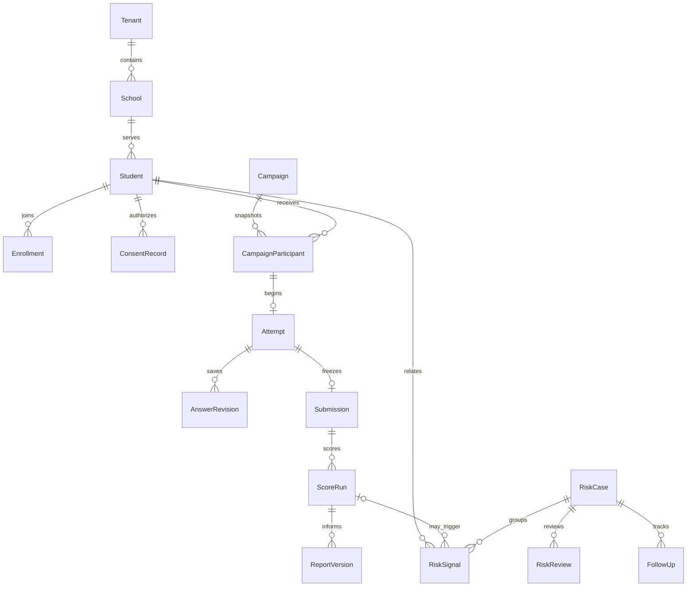

# 数据模型与 API 草案

这是接口与领域设计，并同步描述本仓库的合成参考 API；它不代表已部署生产 API。`/v1` 表示首版 API。

## 1. 关键实体

除平台级租户目录和不含个人资料的公共资源外，所有业务表带 `tenant_id`、ID、时间戳、版本号；敏感表另外记录用途/保留策略。学生 ID 是随机内部标识，不用身份证或手机号作主键。

| 域 | 实体 | 关键字段或不变量 |
|---|---|---|
| 组织 | Tenant、School、AcademicYear、Grade、Class、Enrollment | 学生身份与学年班级关系分开；转班留历史，不搬走历史个案授权 |
| 身份 | User、Membership、RoleGrant、ScopeGrant、AccessApproval | 用户可有多租户成员关系；授权含用途、到期和授予人，职务不自动获得专业访问权 |
| 学生 | Student、GuardianLink | 身份资料加密；监护关系含独立监护账号、核验人、生效/撤销时间；年龄未知 fail closed |
| 采集 | ImportBatch、ImportRowResult、ProfileSchemaVersion、ProfileResponse | 导入幂等；拒绝行可追溯；自定义字段禁止任意扩大敏感采集 |
| 参与治理 | NoticeVersion、ConsentRecord、ProcessingBasis、RightsRequest | 主体/监护人、目的、版本、方式、时间与撤回；权利申请说明使用 `reason_ciphertext` 加密保存并只返回 `hasReason` 标记；其他合法依据不能由前端随意勾选 |
| 量表 | Scale、ScaleVersion、NormVersion、ScoringVersion、ScaleLicense | 适龄/语言/地区/报告人、题目与反向题规则 hash、有效期、专业审批；正文受限存储 |
| 方案 | AssessmentPlanVersion、WarningRuleVersion、ReportTemplateVersion | 不同版本拆分；草稿可编辑，已发布冻结；不允许运行任意管理员脚本 |
| 任务 | Campaign、CampaignParticipant、FrequencyReservation、ExceptionApproval | 学年、场次、成员快照、方案版本；学生/学年频次占用受事务约束 |
| 答卷 | Attempt、AnswerRevision、Submission | 一个 assignment 的提交唯一；保存有 revision，提交有不可变内容摘要 |
| 计分 | ScoreRun、FactorScore、ValidityResult | submission + scoring version 唯一；保留精度、常模版本、缺失策略和证据；invalid 不输出“正常” |
| 报告 | ReportVersion、ReportRelease、ReportAccessRequest | 生成快照、专业审批、不同读者范围；撤回旧发布不删除历史审计 |
| 风险 | RiskSignal、RiskCase、RiskReview、CaseAssignment | 信号有来源和版本；活跃个案可关联多个信号；复核和业务等级分开 |
| 支持 | CarePlan、ContactNote、Referral、FollowUp、ClosureApproval | 最小化接触记录、外部转介状态、随访到期；结案申请人单独留痕并由独立专业人员审批 |
| 预约 | CounselorProfile、AvailabilitySlot、Appointment、Room | 资质审定状态；咨询师/房间时间窗不可冲突；不在预约提醒带心理原因 |
| 内容 | ArticleVersion、MediaAsset、ContentReview | 适龄、版权、审核、有效期；公共教育内容与私有个案附件分开；媒体限制类型/大小、哈希与安全检查，并要求文字替代或字幕 |
| 横切 | AuditEvent、OutboxEvent、DeliveryAttempt、ExportJob、RetentionPolicy、DeletionTombstone | 访问行为审计、投递/接单分别记录、下载再鉴权、保留与删除链路 |

## 2. 主要关系

手工线索允许 `score_run_id = null`，不能强制先完成量表才能求助。未提交草稿与最终提交快照分开加密和保留策略。

## 3. 重要业务约束

- 关联任何学生/答卷/个案时数据库验证同租户，应用还要验证学校/班级/个案权限；仅有随机 UUID 不是授权。
- 量表题目、选项、反向计分、因子、常模、报告模板和风险规则版本独立留痕；必须能从任何报告追溯当时算法。
- 原始答卷和心理工作记录不与可下载名单放在同一个默认查询模型中。
- 危机等级枚举只是工作流优先级，不绑定未经验证的临床 cut-off；规则命中原因可解释，专业意见可以覆盖但必须留痕。
- 频次预约与任务启动原子化；退出未开始的任务可按审定规则释放占用，已完成不得通过删答卷清零；撤回资料时仅在合法必要范围保留最小频次证据。
- 幂等键唯一范围包括租户、主体、动作；同键同内容返回原响应，同键不同内容返回 409。
- 任意重大状态转移需要 `expectedVersion`；过期版本返回 409，避免两人同时复核、结案或预约。
- 不默认永久软删除：删除需覆盖正文、索引、导出、缓存、队列与备份恢复策略。依法需保留的记录限定用途并说明依据。

## 4. REST 边界

统一返回 `requestId`、稳定错误码；列表使用游标，敏感响应 `Cache-Control: no-store`。浏览器对所有状态变更校验 `Origin`（可通过 `CAMPMIND_ALLOWED_ORIGINS` 配置反向代理域名）；不受信来源返回 `CSRF_ORIGIN_INVALID`。未授权对象返回统一的不泄露存在性的错误。下列接口均在服务端检查身份、租户、角色和数据范围。学生无手机场景可由 `POST /v1/admin/student-credentials` 签发一次性短期凭证，再通过登录接口的 `accessCode` 字段兑换；服务端不保存原码。

| 接口草案 | 用途 | 关键保护 |
|---|---|---|
| `POST /v1/auth/login`、`POST /v1/auth/logout` | 具名会话 | 令牌只存 hash；启用 MFA 的职员需 RFC 6238 验证码并拒绝即时重放（生产由 IdP/密钥注册接管）；无手机学生可兑换一次性短期凭证；登录按来源限流并返回 `Retry-After`；退登撤销会话 |
| `POST /v1/admin/student-credentials` | 签发无手机学生登录凭证 | 仅校务授权人员可签发；默认 30 分钟、最长 24 小时，原码仅返回一次，重新签发会使旧码失效并写入审计 |
| `POST /v1/admin/users/{userId}/sessions/revoke` | 撤销指定用户的活跃会话与未兑换学生凭证 | 仅同租户/学校的校务授权人员；服务端写入撤销时间、使未兑换凭证失效并记录 `session.revoked` 审计；不返回令牌或学生资料 |
| `POST /v1/imports/preview` | 导入预检 | 文件隔离、限额、不执行公式/宏、字段合法性 |
| `POST /v1/imports/{id}/commit` | 确认导入 | 审批、幂等、校验预览内容 hash；组织映射人工确认 |
| `POST /v1/guardian-links/verify` | 监护关系核验 | 经确认渠道、限流，不以学号为验证凭据 |
| `POST /v1/guardian-links` | 建立待核验监护关系 | 校务账号只能关联本租户的监护账号与学生；未核验前不能记录监护同意 |
| `GET/POST /v1/me/consents`、`POST /v1/me/consents/{id}/withdraw` | 同意与撤回 | 主体可查看目的绑定的参与元数据；记录时校验目的/版本/主体/年龄，撤回触发权限与任务更新 |
| `POST /v1/rights-requests`、`GET /v1/me/rights-requests`、`GET /v1/rights-requests/{id}/result` | 查阅/更正/删除申请与结果 | 便捷提交、身份核验、时限跟踪；处理人必须保存加密决定说明，主体只能查看自己提交的申请及完成/拒绝结果，查阅结果只含基本资料与已发布报告，不含原始答卷 |
| `POST /v1/admin/retention/run` | 过期导出/导入预检失效与删除台账重放 | 仅运维指标权限；预检元数据 24 小时后清理，恢复备份后先重放，再开放服务；重复执行幂等 |
| `GET /v1/admin/operations/status`、`POST /v1/admin/operations/requeue-dead-letters` | 队列/通知运行状态与死信补投 | 仅运维指标权限；返回计数和时间，不返回学生或风险正文 |
| `GET /v1/admin/audit` | 读取审计事件元数据 | 仅审计/隐私权限，数量 1–200；不返回答案、报告或咨询正文，读取行为本身写入追加审计 |
| `POST /v1/admin/operations/escalate` | 按已批准时限生成未接单升级提醒 | 只产生受保护待办，不自动结案、不声称已联系到人 |
| `POST /v1/scales/{id}/versions` | 创建量表草稿版本 | 仅专业授权人员，正文不进入普通日志 |
| `POST /v1/scale-versions/{id}/approve` | 专业审定 | 作者/审批人分离；版权、适龄和金标准记录必填 |
| `POST /v1/campaigns`、`POST /v1/campaigns/{id}/publish` | 创建/发布任务 | 名单快照、频次、值班、所需审批、不可变版本 |
| `POST /v1/campaigns/{id}/frequency-exceptions` | 必要复评审批 | 专业负责人记录用途/依据；依据使用 `reason_ciphertext` 加密保存，仅返回 `hasReason`；例外与普通学年场次分开留痕 |
| `POST /v1/scales/{id}/revoke` | 撤销量表版本 | 只阻断新使用，不改写历史答卷和计分；必须记录原因 |
| `GET /v1/me/tasks` | 当前学生任务 | 仅自己，服务端返回适龄、任务窗口、频次状态、量表授权/撤回状态和 `available/availabilityReason`（包括 `scale_unavailable`）；前端不得自行推断可作答 |
| `POST /v1/me/tasks/{id}/attempts` | 开始作答 | 同意/适龄/频次/任务时窗原子验证；已释放场次不能靠旧 assignment 重开 |
| `GET /v1/attempts/{id}` | 恢复草稿 | 仅本人读取服务端已确认的答案与 revision；已提交/关闭答题不可恢复 |
| `PUT /v1/attempts/{id}/answers` | 保存答案 | `expectedRevision`、题目白名单、服务端持久化确认；每次写入重新检查任务窗口/场次 |
| `POST /v1/attempts/{id}/submit` | 提交 | 幂等键、内容 hash、事务快照与 outbox，不再修改；提交前再次检查窗口/场次 |
| `GET /v1/reports/{id}`、`POST /v1/reports/{id}/approve`、`POST /v1/reports/{id}/release`、`POST /v1/reports/{id}/revoke` | 查看/发布报告 | 必须先专业审核再发布；字段权限、读者范围和撤回级联在服务端检查；下载单独鉴权 |
| `GET /v1/students/{id}/archive?purpose=...` | 个案级心理档案 | 仅同租户且在校/个案授权范围内的专业人员；用途必须是批准的 `case_review`、`report_review` 或 `support_follow_up` 并写入审计；班主任/运维拒绝 |
| `POST /v1/risk-signals` | 主动求助/手工线索 | 合法主体、最小内容、加急独立持久化与通知 |
| `POST /v1/cases/{id}/reviews`、`POST /v1/cases/{id}/acknowledgements` | 复核与接单 | 授权专业角色、状态版本；响应只返回工作流元数据，不返回密文或 `signalIds`；接单不等于已处置 |
| `POST /v1/cases/{id}/follow-ups` | 支持与随访 | 个案范围、记录版本、到期提醒；响应只返回 `hasNote`，不返回随访正文或作者内部标识 |
| `POST /v1/cases/{id}/closure-requests`、`POST /v1/cases/{id}/closure-approvals` | 申请/审批结案 | 独立专业复核、证据；响应不返回加密结案依据，拒绝自动结案 |
| `GET /v1/analytics/summary` | 聚合指标 | 固定维度、小样本/互补抑制、查询预算、不支持任意 SQL |
| `GET /v1/content/public?age=` | 公开教育内容 | 可选年龄筛选仅接受 6–19 周岁整数；无效筛选返回 `CONTENT_AGE_INVALID`，内容仍须专业审核发布 |
| `POST /v1/exports`、`GET /v1/exports/{id}/download` | 导出 | 记录有限用途、范围与独立审批；受控产物带 job/purpose/时间水印，到期与授权实时校验 |
| `GET /v1/availability-slots`、`POST /v1/availability-slots`、`POST /v1/availability-slots/{id}/state` | 咨询师排班 | 仅返回同租户未来时段；咨询师/房间不可重叠；已占用时段不能直接停用 |
| `GET /v1/appointments`、`POST /v1/appointments`、`POST /v1/appointments/{id}/state` | 咨询预约 | 资源排他、可选幂等键、资质与可预约窗口；列表不返回预约说明正文；学生只能取消自己的预约 |
| `POST /v1/content/{id}/publish` | 教育内容发布 | M5；专业审核、适龄、版权证明 |
| `POST /v1/content/{id}/retire` | 教育内容下架 | 仅专业审批权限；立即从公开列表移除并使关联媒体 URL 不再可用，保留审计历史 |
| `POST /v1/media-assets`、`GET /v1/content/public/{assetId}/media` | 媒体上传与公开播放 | 仅允许批准类型/大小；签名、脚本特征和哈希检查；媒体正文写入私有对象存储并只在已审核内容关联时公开读取；生产适配器必须隔离租户与 KMS 密钥 |

建议错误码：`CONSENT_REQUIRED`、`AGE_REVIEW_REQUIRED`、`FREQUENCY_REVIEW_REQUIRED`、`CAMPAIGN_CLOSED`、`LICENSE_UNAVAILABLE`、`LICENSE_EXPIRY_REQUIRED`、`LICENSE_EXPIRY_INVALID`、`LICENSE_EXPIRED`、`REVISION_CONFLICT`、`IDEMPOTENCY_CONFLICT`、`APPOINTMENT_IDEMPOTENCY_INVALID`、`SLOT_STATUS_INVALID`、`SLOT_HELD`、`PROFESSIONAL_REVIEW_REQUIRED`、`SLOT_UNAVAILABLE`、`EXPORT_REVOKED`。敏感权限错误不返回其他学生信息。

## 5. 事件契约

事件 envelope：`eventId`、`tenantId`、`type`、`aggregateId`、`aggregateVersion`、`occurredAt`、`schemaVersion`、`traceId`。正文只传必要引用，不传完整答案或咨询记录。

关键事件：`assessment.submitted`、`risk.triage`、`score.completed`、`score.failed`、`risk.signal_created`、`risk.acknowledgement_overdue`、`report.released`、`consent.withdrawn`、`access.revoked`、`export.expired`。Worker 消费时再次验证状态与权限，重复消息不得产生重复个案/重复下载能力；规则线索通过 submission 引用与计分结果关联。
